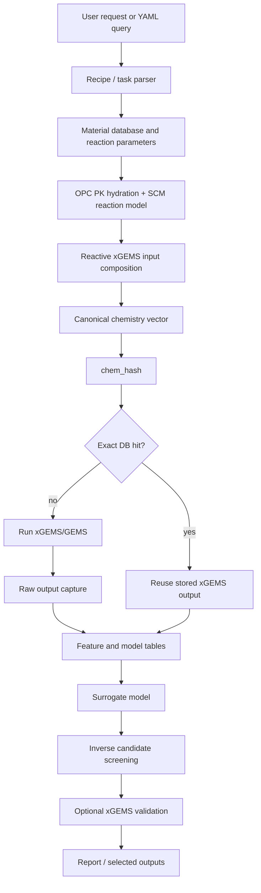

# inverse_gems Framework Overview

This document summarizes the current `inverse_gems` framework. The package is being developed to support forward thermodynamic modeling and, later, inverse design of blended cementitious binders using xGEMS/GEMS.

The current implementation is not a production service and is not a final calibrated scientific model. It is a research framework that connects deterministic binder reaction models, xGEMS/GEMS equilibrium calculations, a chemistry-centered database, surrogate models, active learning, and forward/inverse workflows.

## 1. High-Level Purpose

`inverse_gems` supports two main use cases.

1. Forward calculation

   Given a binder recipe, water condition, age, and thermodynamic database, compute reacted input chemistry, run xGEMS/GEMS, save raw outputs, calculate porosity, and summarize selected phases.

2. Inverse design

   Given target constraints or preferences such as high C-A-S-H, low Portlandite, low porosity, or ettringite below a threshold, search candidate binder compositions using a database and surrogate model, then optionally validate the top candidates with real xGEMS/GEMS calculations.

The core workflow is:



Important design principles:

- User-facing binder recipes are preserved as provenance.
- Database lookup and surrogate modeling are centered on projected reactive chemistry, not raw recipe percentages.
- Raw xGEMS/GEMS phase names are preserved exactly.
- Phase grouping is done only in a separate selected-output layer.
- Reaction model parameters are versioned through a reaction signature.
- Surrogate predictions are not treated as validated thermodynamic results until checked with xGEMS/GEMS.

## 2. Binder Basis and Materials

The default basis is:

```text
100 g total binder
```

Supported materials:

- `OPC`
- `slag` / `BFS`
- `fly_ash` / `FA`
- `metakaolin` / `MK`
- `silica_fume` / `SF`
- `limestone` / `LS`
- `gypsum` / `Gp`
- `water`

The default material database is:

```text
configs/materials.yaml
```

The material database stores:

- oxide mass percentages for OPC and SCMs
- compound mass percentages for limestone
- density values for binder and water volume calculations
- aliases for common material names

Water can be specified in two ways:

```text
w/b mode:
  water_g = 100 * w_b

direct water mode:
  water_g is specified directly as g H2O per 100 g binder
```

The recipe water and the water sent to xGEMS/GEMS can be different. This is handled by the xGEMS water policy layer because equilibrium calculations may need a solver-specific water condition, and pH reliability must be tracked when water is adjusted.

## 3. OPC Phase Composition

OPC phase composition can be provided directly or estimated using the Bogue calculation.

Supported explicit phases:

- `C3S`
- `C2S`
- `C3A`
- `C4AF`

If explicit phase composition is not provided, the fallback Bogue equations are:

```text
C3S  = 4.07*CaO - 7.6*SiO2 - 6.72*Al2O3 - 1.43*Fe2O3 - 2.85*SO3
C2S  = 2.87*SiO2 - 0.75*C3S
C3A  = 2.65*Al2O3 - 1.69*Fe2O3
C4AF = 3.04*Fe2O3
```

Implementation:

```text
src/inverse_gems/bogue.py
```

Negative Bogue values are clipped to zero, and warnings are preserved. Raw Bogue values are retained in metadata.

OPC oxides that the Bogue phases do not carry (SO3, MgO, Na2O, K2O) are added to the xGEMS input
separately (`opc_minor_oxides` policy in the reaction parameters, enabled by default): SO3 enters
as calcium sulfate (its CaO is re-added because Bogue removed it from C3S), Na2O/K2O are fully
released, MgO follows the mass-weighted mean clinker degree. Without this the system had no
sulfur (no AFt/AFm) and no alkalis (pore-solution pH pinned at the portlandite buffer). Disable
with `opc_minor_oxides: {enabled: false}` to reproduce pre-policy chemistry; the policy is part
of the reaction-model signature payload, so cached chemistry hashes differ between the two.

## 4. Parrot-Killoh OPC Hydration Model

OPC clinker hydration is modeled using a refactored Parrot-Killoh style model.

Implementation:

```text
src/inverse_gems/pk_model.py
```

Main API:

```python
parrot_killoh(
    age_days,
    wc,
    RH=1.0,
    T_celsius=20.0,
    fineness_m2_kg=385.0,
)
```

The function returns hydration degrees for:

- `C3S`
- `C2S`
- `C3A`
- `C4AF`

The model evaluates three rate expressions:

- nucleation and growth
- diffusion
- hydration shell

The minimum of these rates is used, with correction factors for:

- water/cement or water/binder condition
- relative humidity
- temperature
- fineness

ODE integration is performed with `scipy.integrate.solve_ivp`. Hydration degrees are bounded to `[0, 1]`.

Current default PK constants:

```text
K1:
  C3S  1.5
  C2S  0.5
  C3A  1.0
  C4AF 0.37

N1:
  C3S  0.7
  C2S  1.0
  C3A  0.85
  C4AF 0.7

K2:
  C3S  0.05
  C2S  0.02
  C3A  0.04
  C4AF 0.015

K3:
  C3S  1.1
  C2S  0.7
  C3A  1.0
  C4AF 0.4

N3:
  C3S  3.3
  C2S  5.0
  C3A  3.2
  C4AF 3.7

Ea, J/mol:
  C3S  41570
  C2S  20785
  C3A  54040
  C4AF 34087

T0:
  293.15 K

reference fineness:
  385 m2/kg
```

These parameters are provisional and should be calibrated before any quantitative scientific claims are made.

## 5. SCM Reaction Model

SCM reaction degrees are modeled with a five-parameter logistic expression:

```text
alpha(t) = D + (A - D) / (1 + (t/C)^B)^G
```

Implementation:

```text
src/inverse_gems/scm_reaction.py
configs/scm_reaction.yaml
```

Default intrinsic parameters:

```text
slag:
  A 0.0
  B 0.75
  C 20.0
  D 0.55
  G 1.0

fly_ash:
  A 0.0
  B 1.05
  C 35.0
  D 0.40
  G 1.0

metakaolin:
  A 0.0
  B 0.95
  C 5.0
  D 0.55
  G 1.0

silica_fume:
  A 0.0
  B 0.80
  C 3.0
  D 0.85
  G 1.0
```

The output reaction degree is clipped to `[0, 1]`.

## 6. C3S/C2S Availability Modifier

The intrinsic SCM reaction curves represent approximate SCM reactivity in blended OPC systems. However, if OPC-derived calcium silicate availability is low, the maximum attainable SCM reaction degree should also be reduced.

This is handled by:

```text
src/inverse_gems/availability_modifier.py
configs/c3s_c2s_availability.yaml
```

The modifier changes only the upper asymptote `D` of the SCM logistic model:

```text
alpha_i(t) = D_eff_i + (A_i - D_eff_i) / (1 + (t/C_i)^B_i)^G_i

D_eff_i = min(D_absmax_i, D_ref_i * R^eta_i)
R = availability_mix / availability_reference
```

The availability index is:

```text
C3S_C2S_supply_index =
  m_OPC * (f_C3S + 0.30 * f_C2S)

SCM_demand_index =
  sum(m_SCM_i * q_i)

availability =
  C3S_C2S_supply_index / SCM_demand_index
```

Default demand coefficients:

```text
slag         0.35
fly_ash      0.75
metakaolin   1.00
silica_fume  1.20
```

Default sensitivity exponents:

```text
slag         0.35
fly_ash      0.60
metakaolin   0.90
silica_fume  1.00
```

Default absolute maximum `D`:

```text
slag         0.75
fly_ash      0.60
metakaolin   0.95
silica_fume  0.95
```

This modifier does not inspect Portlandite or other xGEMS outputs. It is based only on OPC C3S/C2S availability and SCM demand. A future version may add more sophisticated activator models.

## 7. Reaction Parameter Provenance

Reaction parameter provenance is managed by:

```text
configs/reaction_model.yaml
```

The reaction signature includes the following files:

```text
src/inverse_gems/pk_model.py
src/inverse_gems/scm_reaction.py
src/inverse_gems/availability_modifier.py
src/inverse_gems/bogue.py
src/inverse_gems/xgems_input_builder.py
configs/materials.yaml
configs/scm_reaction.yaml
configs/c3s_c2s_availability.yaml
configs/species_map.yaml
```

If these files change, the reaction model signature changes. This makes it possible to keep old results while clearly identifying which parameter set generated each result.

## 8. xGEMS/GEMS Input Construction

xGEMS input is constructed by:

```text
src/inverse_gems/xgems_input_builder.py
```

The default mode is:

```text
reacted_only
```

### reacted_only Mode

In this mode, only the reacted or available portion of the binder is sent to xGEMS/GEMS.

OPC:

- Bogue or user-provided phase composition is used.
- PK hydration degrees are calculated for C3S, C2S, C3A, and C4AF.
- Only reacted clinker phase mass is added to xGEMS/GEMS.
- Unreacted OPC mass is stored for porosity calculation.

SCMs:

- SCM reaction degree is calculated from the logistic model.
- SCM oxide composition is converted to reacted oxide mass.
- Only reacted SCM oxides are added to xGEMS/GEMS.
- Unreacted SCM mass is stored for porosity calculation.

Limestone and gypsum:

- Limestone is added as available CaCO3 by default.
- Gypsum is added as available gypsum/Gp by default.

Unreacted binders:

- They are not added to xGEMS/GEMS in `reacted_only` mode.
- They are included externally in the porosity calculation.

### lower_bound_legacy Mode

This optional mode follows the older logic in which total clinker phases are added and lower bounds represent unreacted clinker. It is not the default mode, but the architecture does not block it.

## 9. Species Map and Formula Mode

Species mapping is configured in:

```text
configs/species_map.yaml
```

Example mapping:

```text
C3S  -> C3S
C2S  -> C2S
C3A  -> C3A
C4AF -> C4AF
H2O  -> H2O@
CaCO3 -> Cal
gypsum -> Gp
SiO2 -> SiO2
Al2O3 -> Al2O3
```

If a different `dat.lst` uses different species names, this file should be edited.

Some xGEMS/GEMS databases may not accept oxide species directly. For that case, `XGEMSRunner` also supports formula input mode through:

```text
configs/formula_map.yaml
```

In formula mode, amounts are added using formulas rather than direct species names.

## 10. xGEMS/GEMS Runner

The real runner is:

```text
src/inverse_gems/xgems_runner.py
```

Main class:

```python
XGEMSRunner(
    dat_lst_path,
    temperature_celsius=20.0,
    gems_class_path="run.GEMSCalc:GEMS",
    input_mode="species",
)
```

The runner:

- accepts a user-specified `dat.lst`
- imports a configurable GEMS class
- sets temperature in Kelvin when supported by the API
- adds species amounts or formula amounts
- optionally adds a small amount of O2 for numerical stability
- applies lower bounds in legacy mode
- calls `equilibrate()`
- captures raw object state without assuming every attribute exists

Captured raw state may include:

- phase masses
- phase volumes
- phase amounts
- phase molar volumes
- phase species moles
- system volume
- system mass
- pH
- aqueous species
- species amounts
- solver status
- simple scalar attributes
- available attribute names
- missing requested attributes

A mock runner is also provided for tests and file-writing workflows:

```text
MockXGEMSRunner
```

## 11. Raw Output Capture

Every xGEMS/GEMS run creates a run directory and writes raw outputs.

Implementation:

```text
src/inverse_gems/xgems_output_capture.py
```

Expected output files:

```text
manifest.json
input_user_request.txt
input_recipe.json
input_materials_used.json
input_reaction_degrees.json
input_xgems_species_amounts.json
run_provenance.json
xgems_phase_amounts_raw.csv
xgems_phase_volumes_raw.csv
xgems_phase_volumes_reconstructed.csv
xgems_phase_volume_reconstruction_report.csv
xgems_phase_volume_reconstruction_summary.json
xgems_aqueous_species_raw.csv
xgems_scalars_raw.json
xgems_attribute_report.json
xgems_stdout.txt
xgems_stderr.txt
porosity.json
warnings.json
```

Critical rule:

- Do not rename raw phases.
- Do not merge raw phases.
- Do not create raw phase aliases.
- Do not decide which raw phases are important.

The raw output is preserved so the researcher can inspect the phase list before defining selected outputs or phase groups.

## 12. Selected Output and Phase Grouping

Raw outputs are preserved. A separate selected-output layer is used for researcher-facing summaries and surrogate targets.

Configuration:

```text
configs/output_selection.yaml
```

Current grouping:

```text
C-A-S-H =
  CNASH

ettringite =
  ettringite
  SO4_CO3_AFt
  CO3_SO4_AFt

monosulfate =
  OH_SO4_AFm
  SO4_OH_AFm
  C4AH19

hemicarbonate =
  C4Ac0.5H12

monocarbonate =
  C4AcH11

siliceous hydrogarnet =
  C3(AF)S0.84H

straetlingite =
  straetlingite

aluminosilicate gel =
  ZeoliteP
  Chabazite
  Silica-amorph

Water =
  aq_gen
```

The following phases are kept as individual selected outputs:

```text
Calcite
OH-hydrotalcite
Brucite
Gypsum
Portlandite
Al(OH)3mic
```

This grouping is configurable and should be revised as the researcher inspects real xGEMS/GEMS outputs.

## 13. Porosity Calculation

Porosity is calculated as:

```text
porosity = 1 - V_solid_final / V_initial
```

Initial volume:

```text
V_initial =
  V_water_initial + sum(V_initial_binder_i)

V_water_initial =
  m_water / rho_water

V_initial_binder_i =
  m_i / rho_i
```

For `reacted_only` mode:

```text
V_solid_final =
    V_solid_phases_from_xGEMS
  + V_unreacted_OPC
  + V_unreacted_SCMs
```

Implementation:

```text
src/inverse_gems/porosity.py
configs/porosity.yaml
```

Current defaults:

```text
include_unreacted_binders: true
xgems_run_mode: reacted_only
xgems_phase_volume_unit: cm3
prefer_reconstructed_phase_volumes: true
clip_porosity_to_0_1: false
```

If porosity is outside `[0, 1]`, the value is not clipped by default. A warning is recorded instead.

## 14. Water Policy and pH Reliability

xGEMS equilibrium water can be different from the recipe water.

Configuration:

```text
configs/xgems_water.yaml
```

Supported modes:

```text
initial
fraction_of_initial
cap_w_b
fixed_w_b
direct_water_g
```

Adaptive retry can be enabled for failed xGEMS/GEMS calculations. In that case, a failed primary calculation can be retried with a modified water condition.

Important interpretation rule:

- pH is calculated for the actual water condition sent to xGEMS/GEMS.
- If a case was rescued by modifying water, the calculated pH may not represent the original recipe water condition.
- Such cases should be flagged as pH-uncertain.

Relevant metadata:

```text
solver_rescued
xgems_retry_count
primary_solver_status
retry_history_json
pH_water_reliable
pH_unreliable_reason
```

## 15. Database Design

The current main local database is:

```text
data/global_chem_db_real_v1_multiage/
```

Current structure:

```text
data/global_chem_db_real_v1_multiage/
  inverse_gems.sqlite
  chemistry_runs/
  prepared_chemistry_runs/
  recipe_runs/
  batch_status.csv
  global_chemistry/
    global_feature_table.csv
    global_model_table.csv
    global_surrogate/
```

This is not only a recipe database. It is primarily a reactive-chemistry database.

The user may input:

```text
OPC 40, slag 60, w/b 0.4, age 56
```

Internally, the recipe is converted to:

```text
reactive xGEMS chemistry vector
```

The chemistry vector is then hashed into:

```text
chem_hash
```

The `chem_hash` is used for exact lookup, caching, active learning, and surrogate modeling.

## 16. Database Layers

The SQLite database contains four important logical layers.

### 16.1 Recipe Layer

SQLite table:

```text
recipe_runs
```

This is the user-facing recipe provenance layer.

It stores:

- recipe ID
- material system
- recipe JSON
- age
- w/b and water mass
- reaction degrees
- initial masses
- reacted masses
- unreacted masses
- prepared ID
- chem_hash
- reaction model signature

The recipe layer answers:

```text
Which binder recipe produced this chemistry?
```

### 16.2 Prepared Chemistry Layer

SQLite table:

```text
prepared_chemistry_runs
```

This layer stores the state after applying:

- Bogue phase calculation
- PK hydration model
- SCM reaction model
- C3S/C2S availability modifier
- species map
- xGEMS water policy

It stores:

- prepared ID
- recipe ID
- chem_hash
- reaction model ID
- reaction model signature
- reaction degrees
- xGEMS species amounts
- unreacted masses
- canonical vector
- oxide-equivalent vector
- source ledger hash

The prepared chemistry layer answers:

```text
What reactive chemistry was generated from this recipe and parameter set?
```

### 16.3 Chemistry Run Layer

SQLite table:

```text
chemistry_runs
```

This is the xGEMS/GEMS calculation layer.

It stores:

- chem_hash
- chem_hash version
- dat.lst hash
- species map hash
- temperature
- pressure
- water moles
- canonical vector
- oxide-equivalent vector
- xGEMS run directory
- status
- warnings

The chemistry run layer answers:

```text
Has this exact reactive chemistry already been calculated with this thermodynamic setup?
```

### 16.4 Source Contribution Layer

SQLite table:

```text
source_contributions
```

This layer tracks where each component of the reactive chemistry came from.

Examples:

- how much SiO2 came from fly ash
- how much CaO equivalent came from slag
- how much C3S reacted from OPC
- how much SCM remained unreacted

This layer is useful for debugging, interpretation, and future scientific analysis.

## 17. Current Local Snapshot

At the time this document was written, the local DB snapshot contained approximately:

```text
recipe_runs: 3587 rows
prepared_chemistry_runs: 3556 rows
chemistry_runs: 3806 rows
source_contributions: 137651 rows
global_feature_table.csv: 3587 rows, 160 columns
global_model_table.csv: 3587 rows, 60 columns
```

These values will change as the database is expanded.

## 18. chem_hash

`chem_hash` is the central identity for the reactive chemistry database.

Implementation:

```text
src/inverse_gems/chem_hash.py
src/inverse_gems/chemistry_vector.py
```

The hash payload includes:

- canonical elemental component vector
- water moles
- temperature
- pressure
- `dat.lst` hash
- species map hash
- xGEMS run mode
- optional thermodynamic database identifier
- chem hash version

Numerical values are rounded to significant digits before hashing.

Consequences:

- Different recipes can map to the same `chem_hash` if they produce the same reactive chemistry.
- The same recipe can map to different `chem_hash` values if age or reaction parameters change.
- Changing `dat.lst` or species map changes the hash.
- This allows cached xGEMS/GEMS reuse while preserving scientific provenance.

## 19. Global Chemistry Tables

Configuration:

```text
configs/global_chemistry_db.yaml
```

Main artifacts:

```text
global_feature_table.csv
global_model_table.csv
global_surrogate/
```

### global_feature_table.csv

This is a wide table for analysis and reporting.

It can include:

- recipe metadata
- chem_hash
- material system
- target profile
- water policy
- pH reliability
- solver rescue status
- raw or selected phase values
- grouped phase outputs
- porosity
- uncertainty fields

### global_model_table.csv

This is a cleaner table for surrogate training and inverse design.

Column prefixes:

```text
meta__  metadata
x__     model inputs
y__     model targets
```

Current chemistry input columns include:

```text
x__chem_oxide_equiv_mol_CaO
x__chem_oxide_equiv_mol_SiO2
x__chem_oxide_equiv_mol_Al2O3
x__chem_oxide_equiv_mol_Fe2O3
x__chem_oxide_equiv_mol_MgO
x__chem_oxide_equiv_mol_SO3
x__chem_oxide_equiv_mol_Na2O
x__chem_oxide_equiv_mol_K2O
x__chem_oxide_equiv_mol_CO2
x__chem_oxide_equiv_mol_H2O
x__xgems_water_g
x__temperature_celsius
```

Current targets include:

```text
y__porosity
y__pH
y__amount_C_A_S_H
y__amount_ettringite
y__amount_monosulfate
y__amount_hemicarbonate
y__amount_monocarbonate
y__amount_aluminosilicate_gel
y__amount_Calcite
y__amount_Portlandite
y__amount_OH_hydrotalcite
y__amount_Brucite
```

## 20. Building the Database

A typical database-building workflow is:

1. Generate recipes.
2. Project recipes to reactive chemistry candidates.
3. Run xGEMS/GEMS with caching.
4. Refresh the global chemistry tables.
5. Train the surrogate.
6. Run coverage and diagnostics.
7. Use active learning to add missing regions.

### 20.1 Generate Recipes

```bash
inverse-gems generate-recipes \
  --config configs/sampling.yaml \
  --n 1000 \
  --mode mixed \
  --out data/recipes_global_real_v1_multiage.csv
```

### 20.2 Build a Chemistry Candidate Table

```bash
inverse-gems build-chemistry-candidate-table \
  --recipes-csv data/recipes_global_real_v1_multiage.csv \
  --out reports/candidates/chemistry_candidate_table.csv \
  --dat-lst Test-dat.lst
```

### 20.3 Run xGEMS/GEMS with Caching

```bash
inverse-gems run-batch-cached \
  --recipes-csv data/recipes_global_real_v1_multiage.csv \
  --db data/global_chem_db_real_v1_multiage \
  --dat-lst Test-dat.lst \
  --xgems-input-mode formula
```

### 20.4 Refresh Global Chemistry DB

```bash
inverse-gems refresh-global-chem-db \
  --db data/global_chem_db_real_v1_multiage
```

### 20.5 Train Global Surrogate

```bash
inverse-gems train-global-chem-surrogate \
  --db data/global_chem_db_real_v1_multiage \
  --surrogate-config configs/surrogate_baseline.yaml
```

### 20.6 Coverage and Diagnostics

```bash
inverse-gems global-chemistry-coverage \
  --db data/global_chem_db_real_v1_multiage
```

```bash
inverse-gems model-registry-diagnostics \
  --model-registry configs/design_query_model_registry.global_v1.yaml \
  --out reports/model_registry_diagnostics
```

## 21. Surrogate Model

Surrogate configuration:

```text
configs/surrogate_baseline.yaml
```

Current default model:

```text
ExtraTreesRegressor
n_estimators: 300
random_state: 42
n_jobs: -1
min_samples_leaf: 2
max_features: 1.0
```

Split strategy:

```text
strategy: group_shuffle
group_column: meta__recipe_id
group_regex: ^(.*)_age_[0-9p.]+$
test_size: 0.2
```

The group split is used to reduce leakage across different ages of the same base recipe.

Sparse target support is enabled. This matters for targets such as hemicarbonate or aluminosilicate gel, where most rows may be zero and only a narrow chemistry region produces nonzero values.

The surrogate is used for:

- fast inverse candidate screening
- ranking candidate recipes
- estimating phase targets before expensive xGEMS validation
- identifying out-of-domain candidates
- active learning acquisition

Surrogate output should be interpreted carefully:

- `surrogate_only` candidates are not validated thermodynamic results.
- Sparse phase predictions may have poor R2 unless the nonzero region is well sampled.
- pH predictions can be unreliable when water policy or rescued cases are involved.

## 22. Active Learning and Target-Region Acquisition

Active learning is used to decide which additional xGEMS/GEMS calculations would most improve the database.

Relevant modules:

```text
src/inverse_gems/active_learning_priority.py
src/inverse_gems/target_region_analysis.py
src/inverse_gems/global_chemistry_db.py
src/inverse_gems/global_chemistry_cycle.py
```

The workflow is:

1. Diagnose surrogate performance and sparse targets.
2. Select targets needing more data.
3. Analyze regions where those targets are nonzero.
4. Generate a candidate pool.
5. Score candidates by novelty, domain distance, predicted target value, and target-region proximity.
6. Run selected candidates with real xGEMS/GEMS.
7. Refresh the DB and retrain the surrogate.

Example:

```bash
inverse-gems run-global-acquisition-cycle \
  --db data/global_chem_db_real_v1_multiage \
  --candidate-table reports/candidates/chemistry_candidate_table.csv \
  --dat-lst Test-dat.lst \
  --max-candidates 10 \
  --surrogate-config configs/surrogate_baseline_xgems_env.yaml \
  --priority-target y__amount_hemicarbonate \
  --target-region-table reports/target_region_hemicarbonate/target_region_nonzero_rows.csv \
  --xgems-input-mode formula
```

Acquisition scoring considers:

- exact chem_hash hits
- near-exact chemistry hits
- novelty
- distance to existing chemistry domain
- whether inputs are outside the current model range
- predicted priority target magnitude
- proximity to known nonzero target regions

## 23. Forward Calculation

Forward calculation evaluates a specified recipe.

### Single Recipe

```bash
inverse-gems forward \
  --dat-lst Test-dat.lst \
  --recipe "OPC 30, fly ash 70, w/b 0.4, age 28" \
  --out runs/
```

Mock:

```bash
inverse-gems forward-mock \
  --recipe "OPC 30, fly ash 70, w/b 0.4, age 28" \
  --out runs/
```

Cached:

```bash
inverse-gems forward-cached \
  --dat-lst Test-dat.lst \
  --recipe "OPC 30, fly ash 70, w/b 0.4, age 28" \
  --db data/global_chem_db_real_v1_multiage
```

### Forward Query

Forward query YAML files support single-age or time-series workflows.

Examples:

```text
configs/forward_query.single_age.example.yaml
configs/forward_query.volume_vs_time.example.yaml
configs/task_query.forward_volume_vs_time.example.yaml
```

Run:

```bash
inverse-gems run-forward-query \
  --dat-lst Test-dat.lst \
  --query configs/forward_query.volume_vs_time.example.yaml \
  --out reports/forward_query
```

Global DB version:

```bash
inverse-gems run-global-forward-query \
  --db data/global_chem_db_real_v1_multiage \
  --query configs/forward_query.volume_vs_time.example.yaml \
  --out reports/global_forward_query
```

Forward outputs can include:

- raw phase masses
- raw phase volumes
- reconstructed phase volumes
- selected phase groups
- pH
- porosity
- unreacted binder masses
- uncertainty flags
- plots
- narrative or answer summaries

## 24. Inverse Design

Inverse design takes goals and constraints rather than a fixed recipe.

Example user requests:

```text
Use only OPC and MK. At 28 days, find the composition with maximum CNASH.
```

```text
Use only OPC and fly ash. At 100 days and w/b 0.45, minimize Portlandite and porosity.
```

The inverse design workflow:

1. Parse the request into a design query.
2. Determine allowed materials, age, water condition, targets, and constraints.
3. Route to an appropriate model or global chemistry DB.
4. Generate or read candidate compositions.
5. Convert candidates to reactive chemistry vectors.
6. Check exact chem_hash hits and nearest chemistry.
7. Use the surrogate to screen candidates.
8. Apply hard constraints.
9. Rank candidates by objectives or preference order.
10. Optionally validate top candidates with xGEMS/GEMS.
11. Write candidate review and report files.

Relevant modules:

```text
src/inverse_gems/design_query.py
src/inverse_gems/model_router.py
src/inverse_gems/chemistry_design_query_runner.py
src/inverse_gems/inverse_design_flow.py
src/inverse_gems/inverse_forward_workflow.py
```

Example global design query:

```bash
inverse-gems run-global-design-query \
  --db data/global_chem_db_real_v1_multiage \
  --query configs/design_query.OPC_metakaolin_age28_max_cnash.yaml \
  --out reports/design_opc_mk_cnash
```

Example inverse plus forward validation:

```bash
inverse-gems run-inverse-forward-workflow \
  --dat-lst Test-dat.lst \
  --query configs/design_query.OPC_metakaolin_age28_max_cnash.yaml \
  --db data/global_chem_db_real_v1_multiage \
  --out reports/inverse_forward_opc_mk_cnash \
  --xgems-input-mode formula
```

## 25. LLM/API Layer

The LLM layer is used to convert natural-language requests into structured task queries.

Relevant files:

```text
src/inverse_gems/openai_task_router.py
src/inverse_gems/task_query.py
src/inverse_gems/task_query_preview.py
configs/task_query.schema.json
configs/llm_task_router.prompt.md
```

Intended flow:

1. User gives a natural-language request.
2. The LLM generates a task query YAML/JSON.
3. The system creates a preview.
4. The user reviews or confirms the preview.
5. The confirmed task is executed by deterministic local code.

Important principle:

The LLM should not decide scientific feasibility or fabricate results. It is a parser and router. Calculation, filtering, ranking, uncertainty flagging, and validation remain local and deterministic.

Example:

```bash
inverse-gems parse-task-query-openai \
  --request-text "Use OPC and MK only, and maximize CNASH at 28 days." \
  --out reports/openai_parse
```

```bash
inverse-gems preview-task-query \
  --query reports/openai_parse/task_query.yaml \
  --out reports/preview
```

```bash
inverse-gems run-confirmed-task-query \
  --dat-lst Test-dat.lst \
  --preview-dir reports/preview \
  --out reports/confirmed_run
```

## 26. Uncertainty and Quality Flags

The framework records uncertainty instead of hiding it.

Common flags include:

```text
validated
surrogate_only
out_of_domain
rescued_water
pH_uncertain
missing_target
sparse_target
```

Relevant modules:

```text
src/inverse_gems/uncertainty.py
src/inverse_gems/xgems_preflight.py
src/inverse_gems/xgems_quality_cases.py
```

Interpretation examples:

- `surrogate_only`: the candidate was screened by a surrogate but not yet validated with xGEMS/GEMS.
- `out_of_domain`: the chemistry is outside the current surrogate training domain.
- `rescued_water`: the primary xGEMS calculation failed and was retried with modified water.
- `pH_uncertain`: pH may not represent the original requested water condition.

## 27. Real xGEMS Environment

On the current Windows machine, xGEMS has been used through a Conda environment. Directly calling the environment's `python.exe` has been more reliable than relying on `conda run` in some cases.

Example PowerShell pattern:

```powershell
$env:PYTHONPATH='C:\Users\solmo\InverseGems\src'
& 'C:\Users\solmo\miniforge3\envs\py313-xgems\python.exe' -m inverse_gems.cli check-env
```

For real calculations, use the local `dat.lst`:

```bash
inverse-gems forward \
  --dat-lst Test-dat.lst \
  --recipe "OPC 30, fly ash 70, w/b 0.4, age 28"
```

The species map and formula mode may need to be adjusted when switching to a different thermodynamic database.

## 28. Current Implementation Status

Implemented components include:

- recipe parser
- material database
- Bogue calculation
- PK hydration model
- SCM reaction model
- C3S/C2S availability modifier
- xGEMS input builder
- real and mock xGEMS runners
- raw output capture
- reconstructed phase volume support
- porosity calculation with unreacted binders
- cached forward calculation
- batch calculation
- SQLite database
- canonical chemistry vector
- chem_hash
- global chemistry feature and model tables
- surrogate training
- model diagnostics
- active learning priority recommendation
- target-region guided acquisition
- forward query
- design query
- task query and LLM parser layer
- inverse-forward workflow

The most recent full test suite run before this document revision passed:

```text
194 passed
```

## 29. Current Limitations

1. Reaction parameters are provisional.

   PK, SCM, and availability modifier parameters are tracked, but not yet fully calibrated.

2. xGEMS/GEMS species names are database-dependent.

   `Test-dat.lst` may support different names than another `dat.lst`.

3. Sparse targets need more data.

   Hemicarbonate, aluminosilicate gel, and other sparse phases require target-region sampling and validation.

4. pH is water-policy sensitive.

   If water was modified to rescue a calculation, pH may not represent the original recipe.

5. Phase grouping is researcher-defined.

   Raw phase names are preserved, but selected phase groups should be revised as more xGEMS outputs are inspected.

6. Surrogate predictions are screening tools.

   Final scientific recommendations should be based on xGEMS/GEMS-validated candidates whenever possible.

## 30. Recommended Next Steps

Recommended next steps:

1. Expand the real reactive chemistry DB.

   Add more continuous-age and mixed-material samples, especially in sparse target regions.

2. Define named calibrated parameter sets.

   For example: `provisional_v1`, `calibrated_v1`, `paper_demo_v1`.

3. Improve demo reports.

   Combine user request, parsed query, model routing, candidate table, surrogate prediction, xGEMS validation, uncertainty flags, and raw output paths into one report.

4. Review phase grouping.

   Inspect raw xGEMS outputs and refine `configs/output_selection.yaml`.

5. Build representative real validation examples.

   Suggested cases:

   - OPC only
   - OPC + slag
   - OPC + fly ash
   - OPC + metakaolin
   - OPC + silica fume
   - OPC + slag + fly ash
   - LC3-like systems

6. Strengthen inverse design credibility.

   Clearly separate surrogate-only suggestions from xGEMS-validated recommendations.

## 31. Key Files

Configuration:

```text
configs/materials.yaml
configs/scm_reaction.yaml
configs/c3s_c2s_availability.yaml
configs/reaction_model.yaml
configs/species_map.yaml
configs/formula_map.yaml
configs/output_selection.yaml
configs/porosity.yaml
configs/xgems_water.yaml
configs/global_chemistry_db.yaml
configs/model_dataset_chemistry_stable_targets.yaml
configs/surrogate_baseline.yaml
```

Core code:

```text
src/inverse_gems/bogue.py
src/inverse_gems/pk_model.py
src/inverse_gems/scm_reaction.py
src/inverse_gems/availability_modifier.py
src/inverse_gems/xgems_input_builder.py
src/inverse_gems/xgems_runner.py
src/inverse_gems/xgems_output_capture.py
src/inverse_gems/porosity.py
src/inverse_gems/database.py
src/inverse_gems/chem_hash.py
src/inverse_gems/chemistry_vector.py
src/inverse_gems/global_chemistry_db.py
src/inverse_gems/global_chemistry_cycle.py
src/inverse_gems/surrogate.py
src/inverse_gems/model_router.py
src/inverse_gems/task_query.py
src/inverse_gems/openai_task_router.py
src/inverse_gems/inverse_forward_workflow.py
```

## 32. One-Sentence Summary

`inverse_gems` converts a user-facing binder recipe into a reaction-model-projected xGEMS chemistry vector, identifies that chemistry with a `chem_hash`, stores raw and selected xGEMS outputs in a chemistry-centered database, and uses that database with surrogate models and optional xGEMS validation to support both forward calculations and inverse design of blended cementitious binders.
